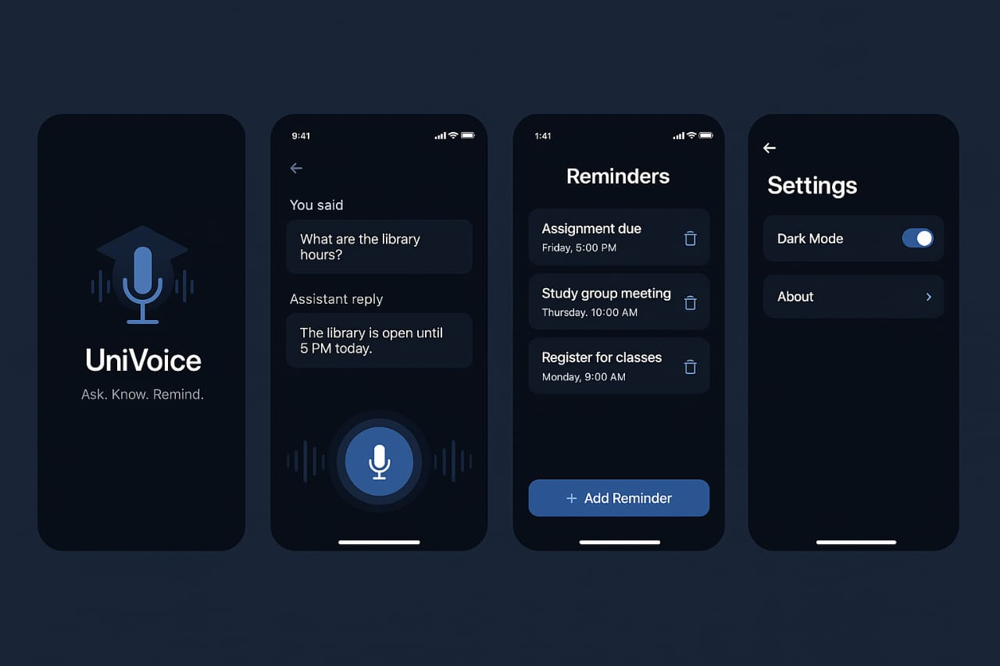

# AI Voice Assistant Flutter App

## Overview

**AI Voice Assistant** is a cutting-edge Flutter application that empowers users to interact seamlessly using natural voice commands. Leveraging real-time speech-to-text conversion and intelligent AI processing, the app understands user intents and responds effectively through both voice and text outputs. Featuring an engaging chat interface and supporting dynamic light and dark theme switching, this application offers a user-friendly and intuitive experience. Notably, it is designed for offline operation, eliminating any dependency on cloud services for core functionality.

---

## Features

- **Real-time Speech-to-Text:** Utilizes the `speech_to_text` package for accurate and instantaneous conversion of spoken words into text.
- **Intelligent AI Processing:** Employs AI-based models for robust intent prediction and the generation of contextually relevant responses.
- **Interactive Chat Interface:** Presents a clear and engaging conversation flow using distinct chat bubbles for user and assistant messages.
- **Microphone Permission Management:** Handles microphone permission requests gracefully, ensuring a smooth user experience.
- **Dynamic Theme Switching:** Offers a visually appealing experience with seamless transitions between light and dark themes.
- **Smooth UI and Responsive Design:** Provides fluid animations and adapts effectively to various screen sizes and orientations.
- **Offline Operation:** Delivers core voice assistant functionality without requiring an active internet connection or cloud dependency.

---

## Screenshots

**Dark Mode:**



---

## Getting Started

Follow these instructions to get a local copy of the project up and running on your device.

### Prerequisites

Ensure you have the following software installed on your development machine:

- **Flutter SDK:** Version 2.10.0 or higher. You can download it from the [official Flutter website](https://flutter.dev/docs/get-started/install).
- **Dart SDK:** The Dart SDK is bundled with the Flutter SDK, so installing Flutter will automatically include Dart. Ensure your Dart version is compatible with your Flutter installation.
- **Development Environment:** Choose your preferred Flutter-supported IDE:
  - [Android Studio](https://developer.android.com/studio)
  - [Visual Studio Code](https://code.visualstudio.com/) with the Flutter extension
  - Other compatible IDEs.
- **Target Device/Emulator:** An Android or iOS device for testing, or a configured emulator/simulator.

### Installation & Setup

1.  **Clone the Repository:**
    Open your terminal or command prompt and navigate to the directory where you want to clone the project. Then, run the following command:

    ```bash
    git clone [(https://github.com/Hassanaawan/Voice-assistant-Ai)]
    cd ai_voice_assistant
    ```

2.  **Get Flutter Dependencies:**
    Navigate to the project directory in your terminal and execute the following command to download all the necessary Flutter packages:

    ```bash
    flutter pub get
    ```

3.  **Android Specific Configuration (Microphone Permission):**
    Ensure that the `RECORD_AUDIO` permission is declared in your Android application's manifest file. This line should already be present, but double-check your `android/app/src/main/AndroidManifest.xml` file to confirm:

    ```xml
    <uses-permission android:name="android.permission.RECORD_AUDIO"/>
    ```

4.  **Backend Setup (for Local Testing):**
    For local testing of the AI backend, follow these steps:

    a. Navigate to the `backend` directory within your project:

    ```bash
    cd backend
    ```

    b. Ensure you have Python installed on your system.

    c. Install any required Python dependencies (if any are listed in a `requirements.txt` file within the `backend` directory):

    ```bash
    pip install -r requirements.txt
    ```

    d. Run the backend application:

    ```bash
    python app.py
    ```

    **Note:** This step assumes you have a Python-based backend in a directory named `backend` with a main application file named `app.py`. Adjust the commands accordingly if your backend setup is different.

5.  **Run the Flutter Application:**
    Open your preferred IDE, navigate to the root directory of the `ai_voice_assistant` project, and run the Flutter application on your connected device or emulator. Alternatively, you can use the terminal:

    ```bash
    flutter run
    ```

    Ensure your device or emulator is connected and recognized by Flutter before running this command.

---
